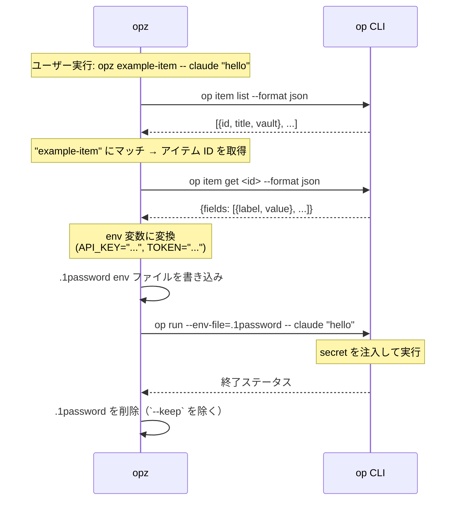

# opz

1Password CLI ラッパー - コマンドへのシームレスな secret 注入のためのツール

## 機能

* キーワード検索でアイテムを検索
* 1Password アイテムの secret を環境変数としてコマンド実行
* 繰り返し実行を高速化するアイテムリストのキャッシュ
* 完全一致がない場合のファジーマッチ

## インストール

```bash
cargo install opz
```

## 使い方

### アイテム検索

キーワードで 1Password アイテムを検索:

```bash
opz find <query>
```

例:
```bash
opz find baz
# 出力: foo   bar     baz
```

### Secret 付きでコマンド実行

1Password アイテムの secret を環境変数としてコマンドを実行:

```bash
opz [OPTIONS] <ITEM> -- <COMMAND>...
```

オプション:
* `--vault <NAME>` - Vault 名（省略時はすべての Vault を検索）
* `--out <PATH>` - 出力 env ファイルパス（デフォルト: `.1password`）
* `--keep` - 生成された env ファイルを残す

例:
```bash
# "example-item" アイテムの secret で claude を実行
opz example-item -- claude "hello"

# デバッグ用に env ファイルを残す
opz --keep example-item -- env

# Vault を指定して env ファイルを残す
opz --vault Private --keep example-item -- your-command
```

## 仕組み

1. 1Password からアイテムリストを取得（60秒間キャッシュ）
2. タイトルで一致するアイテムを検索（完全一致またはファジーマッチ）
3. フィールドを抽出して環境変数に変換
4. 一時的な `.env` ファイルを作成
5. `op run --env-file=...` 経由でコマンドを実行
6. env ファイルを削除（`--keep` 指定時を除く）

## `op` コマンドの利用

セキュリティの透明性のため、`opz` が `op` CLI をどのように利用するかを示します:



**セキュリティ**: `opz` は secret へのアクセスと認証をすべて `op` CLI に委任します。アイテムリストはメタデータのみを 60 秒間キャッシュします。

## 要件

* [1Password CLI](https://developer.1password.com/docs/cli/) (`op`) がインストールされ、認証されていること
