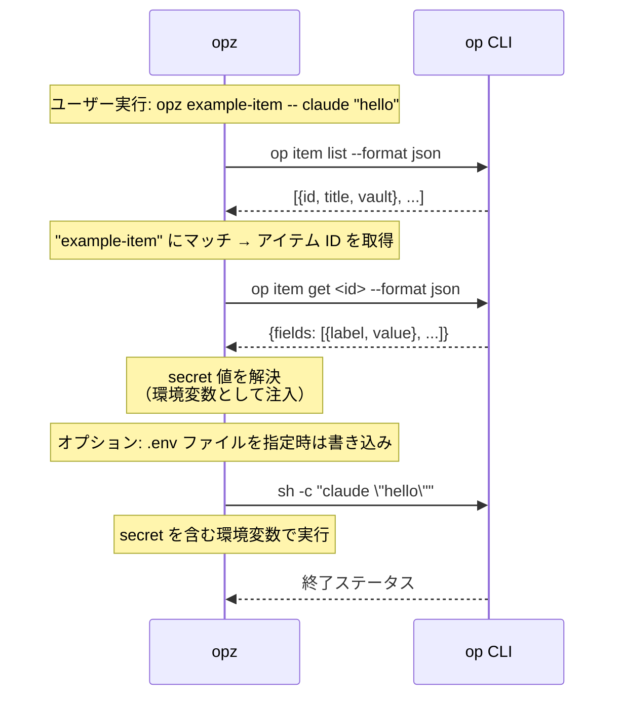

# opz

1Password CLI ラッパー - コマンドへのシームレスな secret 注入のためのツール

## 機能

* キーワード検索でアイテムを検索
* `show` サブコマンドでアイテムの env 有効ラベル名を表示
* 1Password アイテムの secret を環境変数としてコマンド実行
* `gen` サブコマンドで env ファイル生成（既存ファイルに追記、重複キーは上書き）
* `create` サブコマンドで `.env` または private 設定ファイルからアイテムを作成
* 繰り返し実行を高速化するアイテムリストのキャッシュ
* 完全一致がない場合のファジーマッチ

## インストール

```bash
cargo install opz
```

## Trusted publishing

このリポジトリは [crates.io trusted publishing](https://crates.io/docs/trusted-publishing) に対応しています。
`v2025.12.0` のようなタグを作成してプッシュすると、`Publish to crates.io` ワークフローがトリガーされ、OIDC経由で短期間有効なトークンを取得し、`cargo publish --locked` を実行します。
ワークフローがトークンをリクエストできるようにするには、crates.io UI で `opz` クレートに対して trusted publishing を有効にする必要があります（リンクされたリポジトリ: `f4ah6o/opx`）。

## 使い方

### アイテム検索

キーワードで 1Password アイテムを検索:

```bash
opz find <query>
```

例:
```bash
opz find baz
# 出力: foo   bar     baz
```

### アイテムラベル表示

アイテムのフィールドから env 変数として有効なラベル名を表示:

```bash
opz show [OPTIONS] [--with-item] <ITEM>...
```

オプション:
* `--vault <NAME>` - Vault 名（省略時はすべての Vault を検索）
* `--with-item` - アイテムごとの見出しを表示

例:
```bash
# ラベル名のみ（1行1ラベル）
opz show foo bar

# アイテム見出し付きで表示
opz show --with-item foo bar
```

### Secret 付きでコマンド実行

1Password アイテムの secret を環境変数としてコマンドを実行:

```bash
opz run [OPTIONS] [--env-file <ENV>] <ITEM>... -- <COMMAND>...
opz [OPTIONS] [--env-file <ENV>] <ITEM>... -- <COMMAND>...
```

オプション:
* `--vault <NAME>` - Vault 名（省略時はすべての Vault を検索）
* `--env-file <ENV>` - 出力 env ファイルパス（省略時はファイル生成なし）

引数:
* `<ITEM>...` - secret を取得する 1 つ以上のアイテムタイトル

`--env-file` を指定した場合、env ファイルはコマンド実行後も保持されます。既存ファイルがある場合は追記され、重複キーは上書きされます。複数アイテム間で同名キーがある場合は後勝ちです（`opz run foo bar ...` では `bar` が優先）。

例:
```bash
# 1アイテムで実行（.env ファイルは生成されない）
opz run example-item -- your-command

# 複数アイテムで実行（重複キーは後勝ち）
opz run foo bar -- your-command

# secret を注入して .env ファイルも生成
opz run --env-file .env foo bar -- your-command

# 短縮形でも複数アイテム対応
opz --env-file .env.local foo bar -- your-command

# Vault を指定
opz run --vault Private foo bar -- your-command
```

### Env ファイル生成

コマンド実行なしで env ファイルのみを生成:

```bash
opz gen [OPTIONS] [--env-file <ENV>] <ITEM>...
```

例:
```bash
# セクション付きで標準出力
opz gen foo bar

# .env ファイルを生成
opz gen --env-file .env foo bar

# カスタムパスに生成
opz gen --env-file .env.production foo bar

# Vault を指定
opz --vault Private gen foo bar
```

標準出力は `# --- item: <title> ---` のコメント見出し付きです（コメント行は `.env` パーサで無視されます）。

### `.env` または private 設定ファイルからアイテム作成

`create` は `[ENV]` によって2つのモードで動作します:

```bash
opz [OPTIONS] create <ITEM> [ENV]
```

引数:
* `<ITEM>` - `.env` モードで作成する 1Password アイテムタイトル
* `[ENV]` - 読み込むファイルパス（省略時は `.env`）

挙動:
* `[ENV]` が厳密に `.env` の場合:
  * カテゴリ `API Credential` でアイテムを作成
  * タイトルは `<ITEM>` を使用
  * 各 `KEY=VALUE` を `KEY[text]=VALUE` のカスタムテキストフィールドとして追加
  * `export KEY=...`、インラインコメント（`KEY=value # note`）をサポートし、クォート内の `#` は保持
  * 重複キーは後勝ち
* `[ENV]` が `.env` 以外の場合:
  * カテゴリ `Secure Note` でアイテムを作成
  * 本文フォーマットは ```` ```<file name>\n<content>\n``` ````
  * タイトルは git remote URL から抽出した `org/repo` を使用
  * remote が複数ある場合は remote ごとに作成し、同名時は `-2`, `-3`... を付与
  * 解釈可能な git remote がない場合はエラー終了

例:
```bash
# .env から作成
opz create my-service

# private 設定ファイルを Secure Note として保存（タイトルは remote の org/repo）
opz create ignored-item app.conf

# Vault を指定して作成
opz --vault Private create my-service .env
```

## 仕組み

1. 1Password からアイテムリストを取得（60秒間キャッシュ）
2. タイトルで一致するアイテムを検索（完全一致またはファジーマッチ）
3. 各フィールドについて `op://<vault_id>/<item>/<field>` 参照を生成（Vault 名に特殊文字・非ASCIIが含まれても失敗しないよう Vault ID を使用）
4. env ファイルパスが指定されている場合はファイルに書き込み（既存ファイルにマージ、重複キーは上書き）；指定がない場合は標準出力に出力
5. 環境変数として secret を注入してコマンドを実行

`gen` と `show` サブコマンドの場合、ステップ 1-4 のみ実行されます（コマンド実行なし）。

## `op` コマンドの利用

セキュリティの透明性のため、`opz` が `op` CLI をどのように利用するかを示します:



**セキュリティ**: `opz` は secret へのアクセスと認証をすべて `op` CLI に委任します。アイテムリストはメタデータのみを 60 秒間キャッシュします。

## Tracing（OpenTelemetry + Jaeger）

`opz` は OTLP trace 出力に対応していますが、デフォルトでは無効です。`OTEL_EXPORTER_OTLP_ENDPOINT` が未設定の場合は no-op として動作します。

### ローカル手順

```bash
just jaeger-up
just trace-run item=<your-item-title>
just trace-ui
```

### E2E trace を Jaeger で見る

`tests/e2e_real_op.rs` が生成する trace を確認したい場合:

```bash
just jaeger-up
just e2e-trace
just trace-ui
```

Jaeger の Search で service `opz-e2e` を選択してください。  
`just e2e-trace` は `OPZ_GIT_COMMIT=$(git rev-parse --short=12 HEAD)` を自動設定します。

### ref / version 単位で trace を比較する

比較したい各 commit / tag / version で trace を生成した後、次を実行します:

```bash
just trace-report <ref-or-version>
just trace-compare <base-ref-or-version> <head-ref-or-version>
```

`<ref-or-version>` には commit hash、git tag（例: `v2026.2.5`）、`service.version`（例: `2026.2.5`）を指定できます。
どちらも markdown テーブル（duration と最長 child span）を標準出力します。

Jaeger の Search で service `opz`（または `OTEL_SERVICE_NAME`）を選び、以下の span を確認できます:

* `cli.<command>`（root）
* `parse_args`
* `load_config`
* `load_inputs`
* `main_operation`
* `write_outputs`

### 環境変数

* `OTEL_EXPORTER_OTLP_ENDPOINT` - 設定時のみ OTLP export を有効化（例: `http://localhost:4317`）
* `OTEL_SERVICE_NAME` - service 名の任意上書き（デフォルト: `opz`）
* `OTEL_TRACES_SAMPLER` - sampler 設定（`always_on`, `traceidratio` など）
* `OTEL_TRACES_SAMPLER_ARG` - ratio sampler 用パラメータ
* `OPZ_TRACE_CAPTURE_ARGS` - `1` のときのみサニタイズ済み `cli.args` を属性記録（デフォルト: 無効）
* `OPZ_GIT_COMMIT` - trace の resource 属性 `git.commit` の任意上書き（デフォルト: `git rev-parse --short=12 HEAD`）

## 要件

* [1Password CLI](https://developer.1password.com/docs/cli/) (`op`) がインストールされ、認証されていること

## E2Eテスト

実際の1Passwordを使うe2eテストは `tests/e2e_real_op.rs` にあります。

安全のため、`OPZ_E2E=1` を指定した場合にのみ実行されます:

```bash
OPZ_E2E=1 cargo test --test e2e_real_op -- --nocapture
```

または `just` で実行できます:

```bash
just e2e
```
