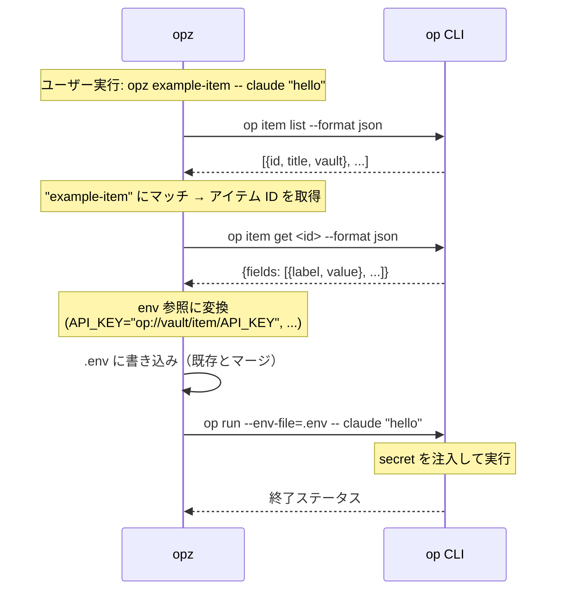

# opz

1Password CLI ラッパー - コマンドへのシームレスな secret 注入のためのツール

## 機能

* キーワード検索でアイテムを検索
* 1Password アイテムの secret を環境変数としてコマンド実行
* `gen` サブコマンドで env ファイル生成（既存ファイルに追記、重複キーは上書き）
* 繰り返し実行を高速化するアイテムリストのキャッシュ
* 完全一致がない場合のファジーマッチ

## インストール

```bash
cargo install opz
```

## Trusted publishing

このリポジトリは [crates.io trusted publishing](https://crates.io/docs/trusted-publishing) に対応しています。
`v2025.12.0` のようなタグを作成してプッシュすると、`Publish to crates.io` ワークフローがトリガーされ、OIDC経由で短期間有効なトークンを取得し、`cargo publish --locked` を実行します。
ワークフローがトークンをリクエストできるようにするには、crates.io UI で `opz` クレートに対して trusted publishing を有効にする必要があります（リンクされたリポジトリ: `f4ah6o/opx`）。

## 使い方

### アイテム検索

キーワードで 1Password アイテムを検索:

```bash
opz find <query>
```

例:
```bash
opz find baz
# 出力: foo   bar     baz
```

### Secret 付きでコマンド実行

1Password アイテムの secret を環境変数としてコマンドを実行:

```bash
opz [OPTIONS] <ITEM> [ENV] -- <COMMAND>...
```

オプション:
* `--vault <NAME>` - Vault 名（省略時はすべての Vault を検索）

引数:
* `<ITEM>` - secret を取得するアイテムタイトル
* `[ENV]` - 出力 env ファイルパス（デフォルト: `.env`）

env ファイルはコマンド実行後も保持されます。既存ファイルがある場合は追記され、重複キーは上書きされます。

例:
```bash
# "example-item" アイテムの secret で claude を実行
opz example-item -- claude "hello"

# カスタム env ファイルパスを指定
opz example-item .env.local -- your-command

# Vault を指定
opz --vault Private example-item -- your-command
```

### Env ファイル生成

コマンド実行なしで env ファイルのみを生成:

```bash
opz gen <ITEM> [ENV]
```

例:
```bash
# .env ファイルを生成
opz gen example-item

# カスタムパスに生成
opz gen example-item .env.production

# Vault を指定
opz --vault Private gen example-item
```

## 仕組み

1. 1Password からアイテムリストを取得（60秒間キャッシュ）
2. タイトルで一致するアイテムを検索（完全一致またはファジーマッチ）
3. 各フィールドを `op://<vault>/<item>/<field>` 参照に変換
4. `.env` ファイルに参照を書き込み（既存ファイルにマージ、重複キーは上書き）
5. `op run --env-file=...` 経由でコマンドを実行（秘密は `op` が解決）

`gen` サブコマンドの場合、ステップ 1-4 のみ実行されます（コマンド実行なし）。

## `op` コマンドの利用

セキュリティの透明性のため、`opz` が `op` CLI をどのように利用するかを示します:



**セキュリティ**: `opz` は secret へのアクセスと認証をすべて `op` CLI に委任します。アイテムリストはメタデータのみを 60 秒間キャッシュします。

## 要件

* [1Password CLI](https://developer.1password.com/docs/cli/) (`op`) がインストールされ、認証されていること
