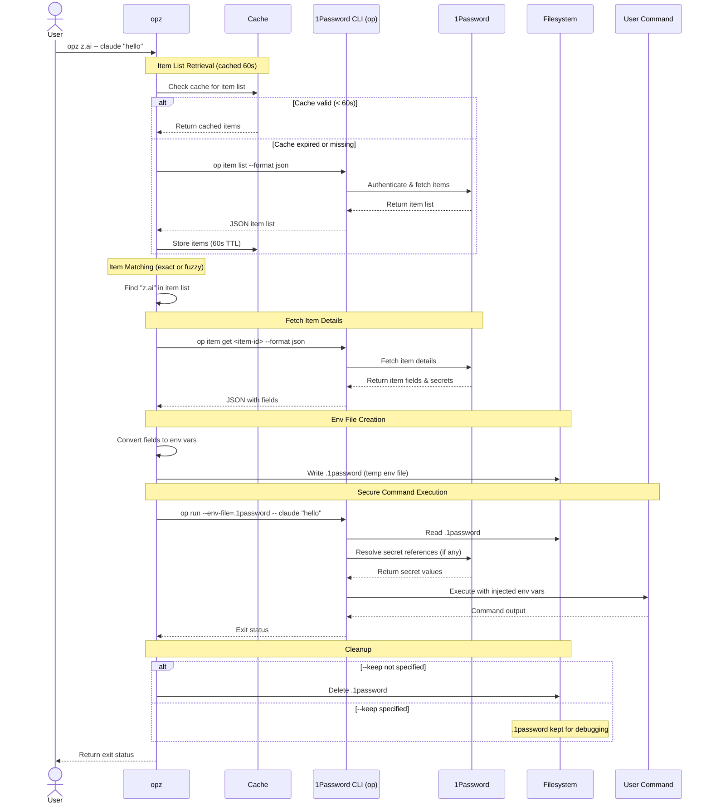

# opz

1Password CLI wrapper for seamless secret injection into commands.

## Features

* Find items by keyword search
* Run commands with secrets from 1Password items as environment variables
* Item list caching for faster repeated runs
* Fuzzy matching when exact title match is not found

## Installation

```bash
cargo install --path .
```

## Usage

### Find Items

Search for 1Password items by keyword:

```bash
opz find <query>
```

Example:
```bash
opz find z.ai
# Output: vjzgubnmgber7mczrkhrq6lkei	Employee	z.ai
```

### Run Commands with Secrets

Run a command with secrets from a 1Password item as environment variables:

```bash
opz [OPTIONS] <ITEM> -- <COMMAND>...
```

Options:
* `--vault <NAME>` - Vault name (optional, searches all vaults if omitted)
* `--out <PATH>` - Output env file path (default: `.1password`)
* `--keep` - Keep the generated env file

Examples:
```bash
# Run claude with secrets from "z.ai" item
opz z.ai -- claude "hello"

# Keep the env file for debugging
opz --keep z.ai -- env

# Specify vault and keep env file
opz --vault Private --keep z.ai -- your-command
```

## How It Works

1. Fetches item list from 1Password (cached for 60 seconds)
2. Finds the matching item by title (exact or fuzzy match)
3. Extracts fields and converts them to environment variables
4. Creates a temporary `.env` file
5. Runs the command via `op run --env-file=...`
6. Cleans up the env file (unless `--keep` is specified)

## Security & Data Flow

For transparency, here's how `opz` interacts with the 1Password CLI (`op`):



### Security Notes

* **No Direct Secret Access**: `opz` never directly accesses secrets - all secret resolution is delegated to `op` CLI
* **Temporary Files**: Environment files are cleaned up by default (use `--keep` only for debugging)
* **Authentication**: All 1Password authentication is handled by `op` CLI
* **Cache Security**: Item list cache (60s TTL) contains only metadata (IDs, titles, vault names), not secrets
* **Secret Injection**: Secrets are injected into the command environment by `op run`, not by `opz`

## Requirements

* [1Password CLI](https://developer.1password.com/docs/cli/) (`op`) installed and authenticated
