# opz

1Password CLI wrapper for seamless secret injection into commands.

## Features

* Find items by keyword search
* Run commands with secrets from 1Password items as environment variables
* Item list caching for faster repeated runs
* Fuzzy matching when exact title match is not found

## Installation

```bash
cargo install opz
```

## Usage

### Find Items

Search for 1Password items by keyword:

```bash
opz find <query>
```

Example:
```bash
opz find baz
# Output: foo	bar	baz
```

### Run Commands with Secrets

Run a command with secrets from a 1Password item as environment variables:

```bash
opz [OPTIONS] <ITEM> -- <COMMAND>...
```

Options:
* `--vault <NAME>` - Vault name (optional, searches all vaults if omitted)
* `--env-file <PATH>` (alias: `--out`) - Output env file path (default: `.env`)
* `--keep` - Keep the generated env file

Examples:
```bash
# Run claude with secrets from "example-item" item
opz example-item -- claude "hello"

# Keep the env file for debugging
opz --keep example-item -- env

# Specify vault and keep env file
opz --vault Private --keep example-item -- your-command
```

## How It Works

1. Fetches item list from 1Password (cached for 60 seconds)
2. Finds the matching item by title (exact or fuzzy match)
3. Extracts fields and converts them to environment variables
4. Creates a temporary `.env` file
5. Runs the command via `op run --env-file=...`
6. Cleans up the env file (unless `--keep` is specified)

## `op` Command Usage

For security transparency, here's how `opz` uses the `op` CLI:

```mermaid
sequenceDiagram
    participant opz
    participant op as op CLI

    Note over opz: User runs: opz example-item -- claude "hello"

    opz->>op: op item list --format json
    op-->>opz: [{id, title, vault}, ...]
    Note over opz: Match "example-item" → get item ID

    opz->>op: op item get <id> --format json
    op-->>opz: {fields: [{label, value}, ...]}
    Note over opz: Convert to env vars<br/>(API_KEY="...", TOKEN="...")

    opz->>opz: Write .env env file

    opz->>op: op run --env-file=.env -- claude "hello"
    Note over op: Inject secrets & execute
    op-->>opz: Exit status

    opz->>opz: Delete .env (unless --keep)
```



**Security**: `opz` delegates all secret access and authentication to `op` CLI. Item list is cached (60s) with metadata only.

## Requirements

* [1Password CLI](https://developer.1password.com/docs/cli/) (`op`) installed and authenticated
