# opz

1Password CLI wrapper for seamless secret injection into commands.

## Features

* Find items by keyword search
* Run commands with secrets from 1Password items as environment variables
* Generate env files with `gen` subcommand (appends to existing, overwrites duplicates)
* Create 1Password items from `.env` files with `create` subcommand
* Item list caching for faster repeated runs
* Fuzzy matching when exact title match is not found

## Installation

```bash
cargo install opz
```

## Trusted publishing

This repository is configured for [crates.io trusted publishing](https://crates.io/docs/trusted-publishing).
Create a tag such as `v2025.12.0` and push it to trigger the `Publish to crates.io` workflow, which mints a short-lived token via OIDC and runs `cargo publish --locked`.
You must enable trusted publishing for the `opz` crate in the crates.io UI (linked repository: `f4ah6o/opx`) before the workflow is allowed to request tokens.

## Usage

### Find Items

Search for 1Password items by keyword:

```bash
opz find <query>
```

Example:
```bash
opz find <query>
# Output: item-1	item-2	item-3
```

### Run Commands with Secrets

Run a command with secrets from a 1Password item as environment variables:

```bash
opz [OPTIONS] <ITEM> [ENV] -- <COMMAND>...
```

Options:
* `--vault <NAME>` - Vault name (optional, searches all vaults if omitted)

Arguments:
* `<ITEM>` - Item title to fetch secrets from
* `[ENV]` - Output env file path (optional, no file generated if omitted)

When `[ENV]` is specified, the env file is preserved after command execution. If the file already exists, new entries are appended and duplicate keys are overwritten.

Examples:
```bash
# Run command with secrets from "example-item" item (no .env file generated)
opz example-item -- your-command

# Run with secrets and generate .env file
opz example-item .env -- your-command

# Specify custom env file path
opz example-item .env.local -- your-command

# Specify vault
opz --vault Private example-item -- your-command
```

### Generate Env File

Generate env file only without running a command:

```bash
opz gen <ITEM> [ENV]
```

Examples:
```bash
# Output env to stdout
opz gen example-item

# Generate .env file
opz gen example-item .env

# Generate to custom path
opz gen example-item .env.production

# Specify vault
opz --vault Private gen example-item
```

### Create Item from `.env`

Create an `opz`-compatible 1Password item from local env file values:

```bash
opz [OPTIONS] create <ITEM> [ENV]
```

Arguments:
* `<ITEM>` - New 1Password item title
* `[ENV]` - Source env file path (optional, defaults to `.env`)

Examples:
```bash
# Create item from .env
opz create my-service

# Create item from custom env file
opz create my-service .env.production

# Create item in specific vault
opz --vault Private create my-service .env
```

## How It Works

1. Fetches item list from 1Password (cached for 60 seconds)
2. Finds the matching item by title (exact or fuzzy match)
3. Builds `op://<vault_id>/<item>/<field>` references for each field (uses vault ID to avoid special/non-ASCII name issues)
4. If env file is specified, writes the file with references (appends to existing, overwrites duplicate keys); otherwise outputs to stdout
5. Runs the command with secrets injected as environment variables

With `gen` subcommand, only steps 1-4 are executed (no command run).

## `op` Command Usage

For security transparency, here's how `opz` uses the `op` CLI:

```mermaid
sequenceDiagram
    participant opz
    participant op as op CLI

    Note over opz: User runs: opz example-item -- claude "hello"

    opz->>op: op item list --format json
    op-->>opz: [{id, title, vault}, ...]
    Note over opz: Match "example-item" → get item ID

    opz->>op: op item get <id> --format json
    op-->>opz: {fields: [{label, value}, ...]}
    Note over opz: Resolve secret values<br/>(inject as env vars)

    Note over opz: Optional: write .env if specified

    opz->>op: sh -c "claude \"hello\""
    Note over opz: Execute with secrets in environment
    op-->>opz: Exit status
```



**Security**: `opz` delegates all secret access and authentication to `op` CLI. Item list is cached (60s) with metadata only.

## Requirements

* [1Password CLI](https://developer.1password.com/docs/cli/) (`op`) installed and authenticated
