# opz
<!-- bdg:begin -->
[](https://crates.io/crates/opz)
[](https://github.com/f4ah6o/opz)
[](https://github.com/f4ah6o/opz/actions/workflows/publish.yaml)
<!-- bdg:end -->

1Password CLI wrapper for seamless secret injection into commands.

## Features

* Find items by keyword search
* Show valid env labels from 1Password items with `show` subcommand
* Run commands with secrets from 1Password items as environment variables
* Generate env files with `gen` subcommand (appends to existing, overwrites duplicates)
* Create 1Password items from `.env` files or private config files with `create` subcommand
* Item list caching for faster repeated runs
* Fuzzy matching when exact title match is not found

## Installation

```bash
cargo install opz
```

## Trusted publishing

This repository is configured for [crates.io trusted publishing](https://crates.io/docs/trusted-publishing).
Create a tag such as `v2025.12.0` and push it to trigger the `Publish to crates.io` workflow, which mints a short-lived token via OIDC and runs `cargo publish --locked`.
You must enable trusted publishing for the `opz` crate in the crates.io UI (linked repository: `f4ah6o/opx`) before the workflow is allowed to request tokens.

## Usage

### Find Items

Search for 1Password items by keyword:

```bash
opz find <query>
```

Example:
```bash
opz find <query>
# Output: item-1	item-2	item-3
```

### Show Item Labels

Show valid env labels from item fields:

```bash
opz show [OPTIONS] [--with-item] <ITEM>...
```

Options:
* `--vault <NAME>` - Vault name (optional, searches all vaults if omitted)
* `--with-item` - Show per-item headers

Examples:
```bash
# Label names only (one per line)
opz show foo bar

# Include item header sections
opz show --with-item foo bar
```

### Run Commands with Secrets

Run a command with secrets from a 1Password item as environment variables:

```bash
opz run [OPTIONS] [--env-file <ENV>] <ITEM>... -- <COMMAND>...
opz [OPTIONS] [--env-file <ENV>] <ITEM>... -- <COMMAND>...
```

Options:
* `--vault <NAME>` - Vault name (optional, searches all vaults if omitted)
* `--env-file <ENV>` - Output env file path (optional, no file generated if omitted)

Arguments:
* `<ITEM>...` - One or more item titles to fetch secrets from

When `--env-file` is specified, the env file is preserved after command execution. If the file already exists, new entries are appended and duplicate keys are overwritten. If duplicate keys exist across items, later items win (`opz run foo bar ...` prefers `bar` values).

Examples:
```bash
# Run command with one item (no .env file generated)
opz run example-item -- your-command

# Run command with multiple items (later items win on duplicate keys)
opz run foo bar -- your-command

# Run with secrets and generate .env file
opz run --env-file .env foo bar -- your-command

# Top-level shorthand also supports multiple items
opz --env-file .env.local foo bar -- your-command

# Specify vault
opz run --vault Private foo bar -- your-command
```

### Generate Env File

Generate env file only without running a command:

```bash
opz gen [OPTIONS] [--env-file <ENV>] <ITEM>...
```

Examples:
```bash
# Output sectioned env references to stdout
opz gen foo bar

# Generate .env file
opz gen --env-file .env foo bar

# Generate to custom path
opz gen --env-file .env.production foo bar

# Specify vault
opz --vault Private gen foo bar
```

Stdout output includes per-item comment headers like `# --- item: <title> ---`; comments are ignored by `.env` parsers.

### Create Item from `.env` or Private Config

`create` has two modes depending on `[ENV]`:

```bash
opz [OPTIONS] create <ITEM> [ENV]
```

Arguments:
* `<ITEM>` - New item title for `.env` mode
* `[ENV]` - Source file path (optional, defaults to `.env`)

Behavior:
* If `[ENV]` is exactly `.env`:
  * Creates an item in category `API Credential`
  * Uses `<ITEM>` as title
  * Adds each `KEY=VALUE` as a custom text field `KEY[text]=VALUE`
  * Supports `export KEY=...`, inline comments (`KEY=value # note`), and keeps `#` inside quotes
  * For duplicate keys, the last entry wins
* If `[ENV]` is anything other than `.env`:
  * Creates item(s) in category `Secure Note`
  * Builds note body as ```` ```<file name>\n<content>\n``` ````
  * Uses git remote repo name (`org/repo`) as item title
  * If multiple remotes exist, creates one item per remote; duplicate titles get `-2`, `-3`, ...
  * Fails if no parseable git remote is available

Examples:
```bash
# Create item from .env
opz create my-service

# Save private config as Secure Note (title from git remote org/repo)
opz create ignored-item app.conf

# Create item in specific vault
opz --vault Private create my-service .env
```

## How It Works

1. Fetches item list from 1Password (cached for 60 seconds)
2. Finds the matching item by title (exact or fuzzy match)
3. Builds `op://<vault_id>/<item>/<field>` references for each field (uses vault ID to avoid special/non-ASCII name issues)
4. If env file is specified, writes the file with references (appends to existing, overwrites duplicate keys); otherwise outputs to stdout
5. Runs the command with secrets injected as environment variables

With `gen` and `show` subcommands, only steps 1-4 are executed (no command run).

## `op` Command Usage

For security transparency, here's how `opz` uses the `op` CLI:

```mermaid
sequenceDiagram
    participant opz
    participant op as op CLI

    Note over opz: User runs: opz example-item -- claude "hello"

    opz->>op: op item list --format json
    op-->>opz: [{id, title, vault}, ...]
    Note over opz: Match "example-item" → get item ID

    opz->>op: op item get <id> --format json
    op-->>opz: {fields: [{label, value}, ...]}
    Note over opz: Resolve secret values<br/>(inject as env vars)

    Note over opz: Optional: write .env if specified

    opz->>op: sh -c "claude \"hello\""
    Note over opz: Execute with secrets in environment
    op-->>opz: Exit status
```



**Security**: `opz` delegates all secret access and authentication to `op` CLI. Item list is cached (60s) with metadata only.

## Tracing (OpenTelemetry + Jaeger)

`opz` can emit OTLP traces, but it is disabled by default. If `OTEL_EXPORTER_OTLP_ENDPOINT` is not set, tracing is a no-op.

### Local setup

```bash
just jaeger-up
just trace-run item=<your-item-title>
just trace-ui
```

### E2E trace on Jaeger

If you want to inspect traces generated by `tests/e2e_real_op.rs`:

```bash
just jaeger-up
just e2e-trace
just trace-ui
```

In Jaeger Search, select service `opz-e2e`.  
`just e2e-trace` automatically sets `OPZ_GIT_COMMIT=$(git rev-parse --short=12 HEAD)`.

### Compare traces by ref or version

Generate traces on each target commit/tag (or release version), then compare:

```bash
just trace-report <ref-or-version>
just trace-compare <base-ref-or-version> <head-ref-or-version>
```

`<ref-or-version>` accepts commit hash, git tag (for example `v2026.2.5`), or `service.version` (for example `2026.2.5`).
Both commands print markdown tables (duration and top child span) for easy copy into PRs.

Then open Jaeger Search and select service `opz` (or your `OTEL_SERVICE_NAME`) to inspect spans such as:

* `cli.<command>` (root)
* `parse_args`
* `load_config`
* `load_inputs`
* `main_operation`
* `write_outputs`

### Environment variables

* `OTEL_EXPORTER_OTLP_ENDPOINT` - Enables OTLP export when set (example: `http://localhost:4317`)
* `OTEL_SERVICE_NAME` - Optional service name override (default: `opz`)
* `OTEL_TRACES_SAMPLER` - Optional sampler setting (`always_on`, `traceidratio`, etc.)
* `OTEL_TRACES_SAMPLER_ARG` - Optional sampler parameter (for ratio-based samplers)
* `OPZ_TRACE_CAPTURE_ARGS` - `1` to include sanitized `cli.args` in trace attributes (default: disabled)
* `OPZ_GIT_COMMIT` - Optional override for trace resource attribute `git.commit` (default: `git rev-parse --short=12 HEAD`)

## Requirements

* [1Password CLI](https://developer.1password.com/docs/cli/) (`op`) installed and authenticated

## E2E Test

Real 1Password e2e test is available in `tests/e2e_real_op.rs`.

It is gated for safety and runs only when `OPZ_E2E=1` is set:

```bash
OPZ_E2E=1 cargo test --test e2e_real_op -- --nocapture
```

Or use just:

```bash
just e2e
```
